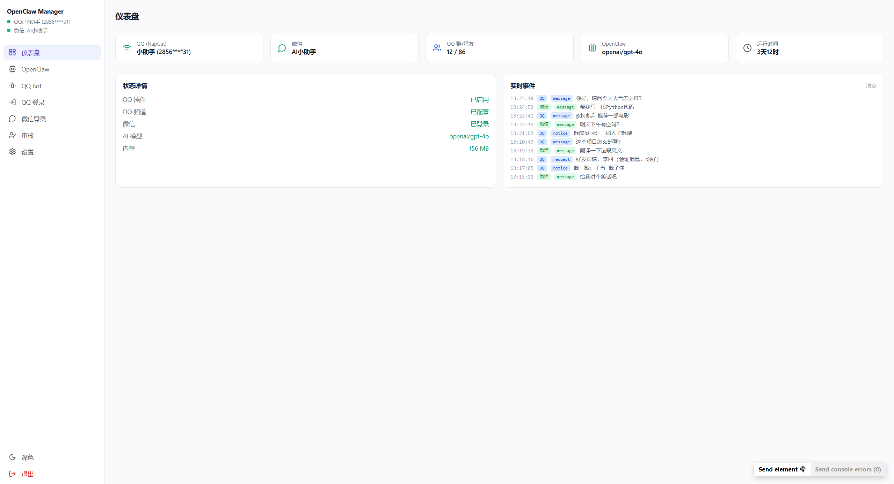
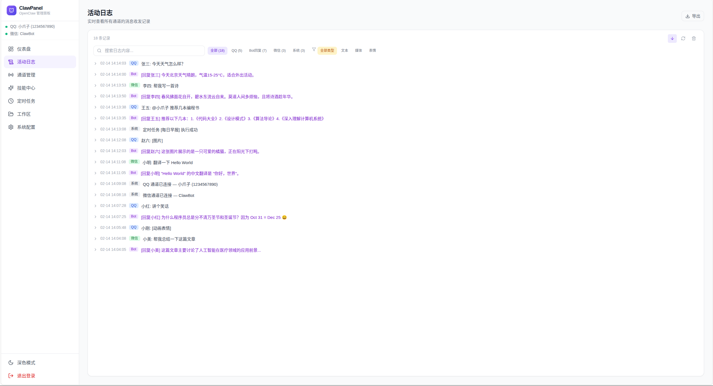
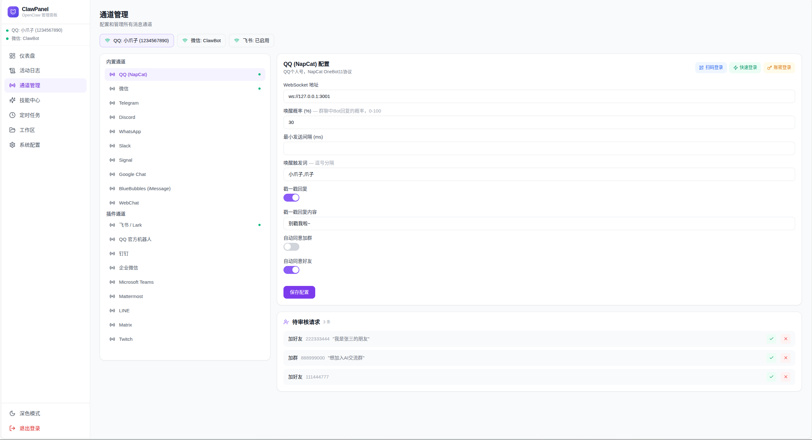
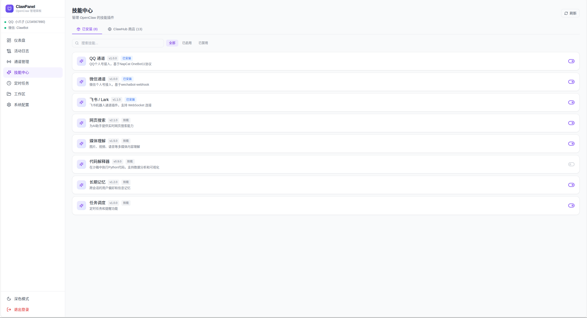
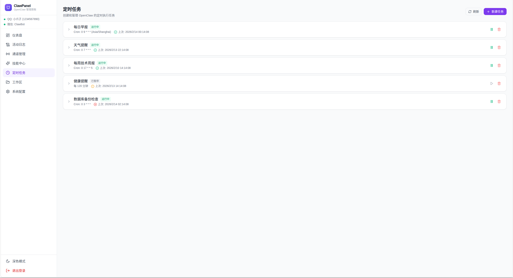

<div align="center">

# 🐾 ClawPanel

**OpenClaw 智能管理面板 — 比官方控制台更强大的可视化管理工具**

多通道接入 · 技能管理 · 定时任务 · 深度配置 · Docker 一键部署

[](LICENSE)
[](docker-compose.yml)
[](https://github.com/zhaoxinyi02/ClawPanel/releases)
[](https://github.com/zhaoxinyi02/ClawPanel/stargazers)

[快速开始](#-快速开始) · [功能特性](#-主要功能) · [效果预览](#-效果预览) · [API 文档](docs/API.md) · [部署指南](docs/DEPLOYMENT.md)

</div>

---

> [!CAUTION]
> **⚠️ 免责声明 | Disclaimer**
>
> 本项目仅供**学习研究**使用，**严禁用于任何商业用途**。使用第三方客户端登录 QQ/微信可能违反腾讯服务协议，**存在封号风险**，请使用小号测试。本项目作者**未进行任何逆向工程**，仅做开源项目整合，**不对任何后果承担责任**。下载使用即表示同意 [完整免责声明](DISCLAIMER.md)。
>
> This project is for **learning and research purposes only**. **Commercial use is strictly prohibited.** Use at your own risk. See [full disclaimer](DISCLAIMER.md).

> [!NOTE]
> **v4.0 重大升级**：项目从 `openclaw-im-manager` 升级为 **ClawPanel**，从单纯的 IM 管理工具进化为完整的 OpenClaw 智能管理面板。
> 旧版本请查看 [v3.0.0 Tag](https://github.com/zhaoxinyi02/ClawPanel/releases/tag/v3.0.0)。

## ✨ 主要功能

### 📊 仪表盘
实时总览：活跃通道数、AI 模型、运行时间、内存占用、今日消息统计、通道状态卡片、最近活动流。

### 📋 活动日志
增强版日志系统：按来源筛选（QQ / Bot回复 / 微信 / 系统）、按类型筛选（文本 / 媒体 / 表情）、关键词搜索、一键导出。

### 📡 通道管理
支持 **8 种通道**的统一配置：
- **QQ (NapCat)** — 扫码/快速/账密登录，唤醒概率、触发词、戳一戳回复等完整配置
- **微信** — 扫码登录，基于 wechatbot-webhook
- **Telegram** — Bot Token + Webhook
- **Discord** — Bot Token + Guild 配置
- **WhatsApp** — QR 扫码
- **Slack** — Socket Mode
- **Signal** — signal-cli REST API
- **Google Chat** — 服务账号 + Webhook

### ⚡ 技能中心
管理 OpenClaw 技能插件：列表展示、一键启用/禁用、搜索筛选、ClawHub 商店入口。

### ⏰ 定时任务
创建和管理定时执行任务：Cron 表达式配置、启用/暂停/删除、运行状态追踪、消息内容编辑。

### ⚙️ 系统配置
OpenClaw 深度可视化配置，9 大分组：
- 🧠 **模型配置** — 主模型、上下文Token、最大输出
- 👤 **身份设置** — 助手名称、头像、主题色
- 💬 **消息配置** — 系统提示词、历史消息数、消息长度
- 🔧 **工具配置** — 媒体理解、网页搜索
- 🌐 **网关配置** — 端口、认证模式
- 🪝 **Hooks** — Webhook 配置
- 👁️ **会话配置** — 自动压缩、修剪
- 🌍 **浏览器** — 无头模式
- 🔑 **认证密钥** — API Keys 管理

### 📁 工作区 & 审核
文件管理、好友/入群请求审核等原有功能完整保留。

## 📸 效果预览

<table>
  <tr>
    <td align="center"><b>仪表盘</b><br/></td>
    <td align="center"><b>活动日志</b><br/></td>
  </tr>
  <tr>
    <td align="center"><b>通道管理</b><br/></td>
    <td align="center"><b>技能中心</b><br/></td>
  </tr>
  <tr>
    <td align="center"><b>定时任务</b><br/></td>
    <td align="center"><b>系统配置</b><br/></td>
  </tr>
</table>

## 🏗️ 架构

```
┌──────────────────────────────────────────────────────┐
│                  Docker Compose                      │
│                                                      │
│  ┌─────────────────────────────────────────────────┐ │
│  │          openclaw-qq Container                  │ │
│  │  ┌─────────┐  ┌──────────┐  ┌───────────┐      │ │
│  │  │ NapCat  │  │ClawPanel │  │ Frontend  │      │ │
│  │  │  (QQ)   │←→│ Backend  │←→│ (React)   │      │ │
│  │  │  :6099  │  │  :6199   │  │           │      │ │
│  │  └─────────┘  └────┬─────┘  └───────────┘      │ │
│  └─────────────────────┼───────────────────────────┘ │
│                        │ HTTP callback               │
│  ┌─────────────────────┼───────────────────────────┐ │
│  │     openclaw-wechat Container                   │ │
│  │  ┌──────────────────┴──────────────────────┐    │ │
│  │  │   wechatbot-webhook (微信 Web 协议)      │    │ │
│  │  │   :3001 (内部) → :3002 (外部)            │    │ │
│  │  └─────────────────────────────────────────┘    │ │
│  └─────────────────────────────────────────────────┘ │
└──────────┬──────────────┬────────────────────────────┘
           │              │
      ┌────┴────┐    ┌────┴────┐
      │ OpenClaw│    │ Browser │
      │ Gateway │    │ClawPanel│
      └─────────┘    └─────────┘
```

## 🛠️ 技术栈

| 层级 | 技术 |
|:---|:---|
| QQ 协议 | [NapCat](https://github.com/NapNeko/NapCatQQ) (OneBot11 WebSocket) |
| 微信协议 | [wechatbot-webhook](https://github.com/danni-cool/wechatbot-webhook) (Web 微信) |
| 后端 | TypeScript · Express · WebSocket |
| 前端 | React · Vite · TailwindCSS · Lucide Icons |
| AI 引擎 | [OpenClaw](https://openclaw.ai) — 支持 GPT-4o / Claude / Gemini / DeepSeek 等 |
| 部署 | Docker Compose 双容器编排 |

## 🚀 快速开始

### 前提条件

- [Docker](https://docs.docker.com/get-docker/) + Docker Compose
- [OpenClaw](https://openclaw.ai) 已安装

### 1️⃣ 克隆 & 配置

```bash
git clone https://github.com/zhaoxinyi02/ClawPanel.git
cd ClawPanel
cp .env.example .env
```

编辑 `.env`：

```env
ADMIN_TOKEN=你的管理密码        # ClawPanel 登录密码
QQ_ACCOUNT=你的QQ号            # QQ 账号（可选，用于快速登录）
OWNER_QQ=主人QQ号              # 接收通知的 QQ 号
WECHAT_TOKEN=openclaw-wechat   # 微信 Webhook Token
OPENCLAW_DIR=~/.openclaw       # OpenClaw 配置目录
```

### 2️⃣ 启动

```bash
docker compose up -d
```

### 3️⃣ 配置 OpenClaw 频道

```bash
# Linux / macOS
chmod +x setup-openclaw.sh && ./setup-openclaw.sh

# Windows PowerShell
powershell -ExecutionPolicy Bypass -File setup-openclaw.ps1
```

### 4️⃣ 登录 & 使用

1. 浏览器访问 `http://你的服务器IP:6199`
2. 输入 `ADMIN_TOKEN` 登录
3. 左侧 **「通道管理」** → 选择 QQ → 扫码登录
4. 左侧 **「通道管理」** → 选择微信 → 扫码登录
5. 用另一个号给 Bot 发消息，收到 AI 回复即成功 🎉

## 📡 端口说明

| 端口 | 服务 | 说明 |
|:---:|:---|:---|
| `6199` | ClawPanel | 主入口，浏览器访问 |
| `6099` | NapCat WebUI | QQ 协议管理（可选） |
| `3001` | OneBot11 WS | OpenClaw 连接 QQ 用 |
| `3002` | 微信 Webhook | 微信 API 调试用 |

## 🌍 跨平台部署

| 平台 | 启动命令 | 配置脚本 |
|:---:|:---|:---|
| 🐧 Linux | `docker compose up -d` | `./setup-openclaw.sh` |
| 🍎 macOS | `docker compose up -d` | `./setup-openclaw.sh` |
| 🪟 Windows | `docker compose up -d` | `powershell -File setup-openclaw.ps1` |

> [!TIP]
> Windows 用户需在 `.env` 中设置 `OPENCLAW_DIR=C:\Users\你的用户名\.openclaw`

## 📖 文档

| 文档 | 说明 |
|:---|:---|
| [API 接口文档](docs/API.md) | 完整的 REST API + WebSocket 接口说明 |
| [部署指南](docs/DEPLOYMENT.md) | 详细部署步骤、环境变量、防火墙、反向代理、故障排查 |

## ❓ 常见问题

<details>
<summary><b>QQ 扫码后提示登录失败？</b></summary>

确保 QQ 账号没有开启设备锁，或尝试使用快速登录。
</details>

<details>
<summary><b>微信扫码页面打不开？</b></summary>

确保微信容器已启动：`docker compose logs wechat`，且端口 3002 未被占用。
</details>

<details>
<summary><b>微信提示不支持网页版登录？</b></summary>

部分微信账号未开通网页版权限，需要使用较早注册的微信号。
</details>

<details>
<summary><b>OpenClaw 连接不上？</b></summary>

运行 `./setup-openclaw.sh` 重新配置，然后重启 OpenClaw。
</details>

<details>
<summary><b>如何查看日志？</b></summary>

```bash
docker compose logs -f          # 全部日志
docker compose logs -f wechat   # 仅微信容器
```
</details>

<details>
<summary><b>如何更新到最新版？</b></summary>

```bash
git pull && docker compose up -d --build
```
</details>

## 📋 更新日志

### v4.0.0 — ClawPanel 智能管理面板 (2026-02-13)
- 🆕 全新品牌：从 `openclaw-im-manager` 升级为 **ClawPanel**
- 🆕 **仪表盘**：活跃通道、AI 模型、运行时间、内存、今日消息统计
- 🆕 **活动日志**：来源/类型筛选、关键词搜索、日志导出
- 🆕 **通道管理**：8 种通道统一配置（QQ/TG/Discord/微信/WhatsApp/Slack/Signal/Google Chat）
- 🆕 **技能中心**：技能列表、启用/禁用、ClawHub 商店入口
- 🆕 **定时任务**：创建/编辑/删除/暂停、Cron 表达式、运行状态
- 🆕 **系统配置**：9 大分组可视化编辑（模型/身份/消息/工具/网关/Hooks/会话/浏览器/密钥）
- 🎨 全新 UI：紫色渐变品牌、导航分组、深色/浅色主题

### v3.0.0 — QQ + 微信双通道 (2026-02-10)
- 🆕 新增微信个人号接入（基于 wechatbot-webhook）
- 🆕 管理后台新增微信登录页面、微信状态显示
- 🆕 仪表盘支持 QQ + 微信双通道实时事件
- 🌍 跨平台支持（Linux / macOS / Windows）
- 📝 项目更名：`openclaw-qq-plugin` → `openclaw-im-manager`

### v2.0.0 — 全新管理后台 (2026-02-09)
- 💻 全新管理后台 UI（React + TailwindCSS）
- 🔐 集成 QQ 登录（扫码 / 快速 / 账密）
- 🔌 内置 OneBot WS 代理
- 💾 QQ 登录 session 持久化

### v1.0.0 — 初始版本
- 🐳 基础管理后台 + NapCat Docker 集成

## ❤️ 致谢

本项目的实现离不开以下优秀的开源项目：

- [NapNeko/NapCatQQ](https://github.com/NapNeko/NapCatQQ) — QQ 协议框架
- [danni-cool/wechatbot-webhook](https://github.com/danni-cool/wechatbot-webhook) — 微信 Webhook 机器人
- [OpenClaw](https://openclaw.ai) — AI 助手引擎

## ⚠️ 免责声明

> **本项目仅供学习研究使用，严禁商用。**

- 🚫 **严禁商用** — 不得用于任何商业目的、付费服务、收费机器人等
- ⚠️ **封号风险** — 使用第三方客户端登录 QQ/微信可能导致账号被封禁
- 🔒 **无逆向** — 本项目未进行任何逆向工程，仅整合已有开源项目
- 📋 **自担风险** — 使用者需自行承担一切风险和法律责任
- 💰 **作者未盈利** — 本项目作者未从中获取任何经济收益

**详细免责声明请阅读 [DISCLAIMER.md](DISCLAIMER.md)**

## 📄 License

[CC BY-NC-SA 4.0](LICENSE) © 2026 — **禁止商用**

本项目采用 [知识共享 署名-非商业性使用-相同方式共享 4.0 国际许可证](https://creativecommons.org/licenses/by-nc-sa/4.0/deed.zh-hans) 进行许可。
